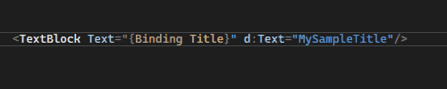
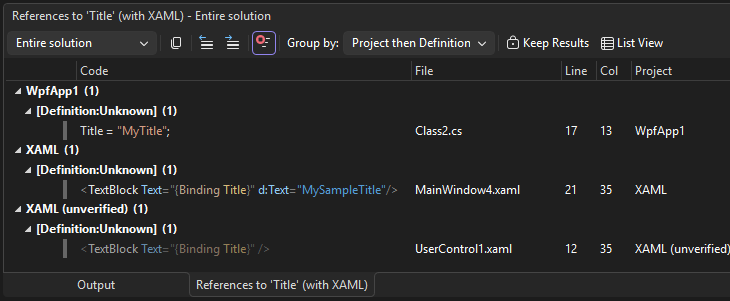
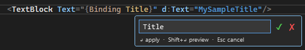
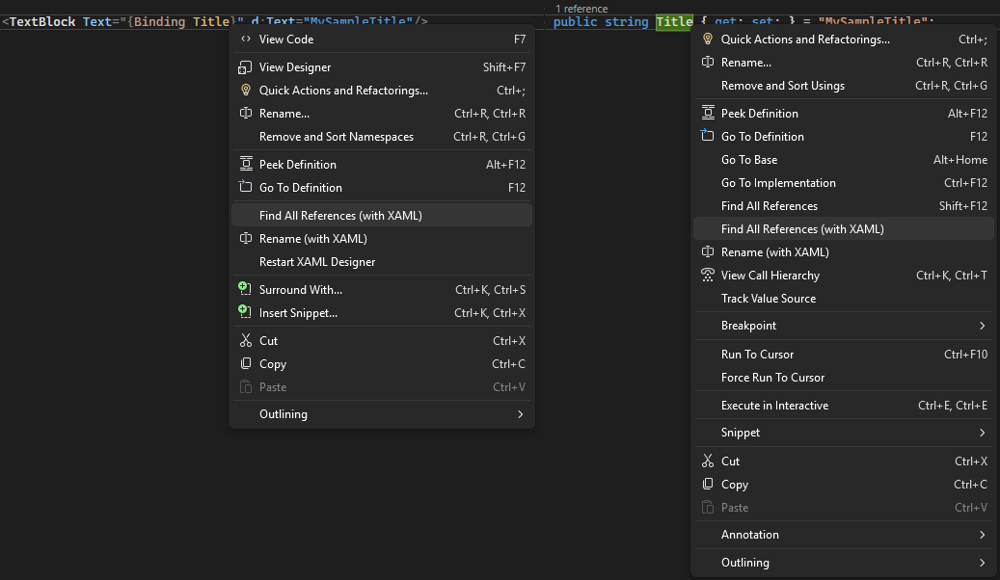
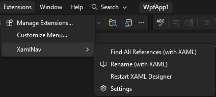

# XamlNav

XAML-aware navigation for Visual Studio 2022+.

Brings the same Ctrl+Click Go To Definition, Find All References, and Rename experience you know from C# into XAML editors. Click a `{Binding}` to jump to the property, or start from C# and find every XAML reference in one step.

## Features

- **Ctrl+Click Go To Definition** — click a `{Binding PropertyName}` in XAML to jump to the C# property definition. Also supports navigating to code-behind classes (e.g., `x:Class="WpfApp.MainWindow"`) and namespace-qualified types (e.g., `Converter={myConv:MyValueConverter}`).
- **Find All References with XAML** — click a `{Binding PropertyName}` in XAML or a C# property symbol to find every usage
- **Rename with XAML** — rename a `{Binding PropertyName}` in XAML or a C# symbol and automatically update all matching XAML binding references
- **Restart XAML Designer** — kill and restart the designer process in one click
- **C# → XAML navigation** — Ctrl+Shift+Click a property in C# to find all XAML bindings that reference it (other click combos are left to VS's built-in Go To Definition)
- **DataContext-aware resolution** — resolves the ViewModel type for bindings using six strategies (in priority order):
  1. `DataTemplate DataType="{x:Type ...}"` and `x:DataType` (innermost template wins)
  2. `d:DataContext="{d:DesignInstance ...}"` on parent elements
  3. `DataContext="{prefix:TypeName}"` direct type markup extensions
  4. Inline property elements (`<Window.DataContext><vm:MyVM /></Window.DataContext>`)
  5. Code-behind analysis (`DataContext = new MyViewModel()` in `.xaml.cs`)
  6. Naming conventions (`MainView.xaml` → `MainViewModel`)

## Screenshots

### Ctrl+Click Go To Definition


### Find All References


### Rename with XAML


### Context Menus


### Extensions Menu


## Requirements

- Visual Studio 2022 or later (version 17.0+)
- .NET Framework 4.8

## Installation

1. Download the latest `.vsix` from the [Releases](../../releases) page.
2. Close Visual Studio.
3. Double-click the file.
4. Restart Visual Studio.

## Usage

| Action | Default shortcut | Alternative |
|--------|-----------------|-------------|
| Go To Definition | **Ctrl+Click** in XAML | — |
| Find All References | **Ctrl+Shift+Click** in XAML or C# | Right-click → *Find All References (with XAML)*, or **Extensions > XamlNav** |
| Rename with XAML | — | Right-click → *Rename (with XAML)*, or **Extensions > XamlNav** |
| Restart XAML Designer | — | **Extensions > XamlNav > Restart XAML Designer** |

### Settings

All mouse+modifier actions are configurable under **Tools > Options > XamlNav > General**:

| Setting | Default | Description |
|---------|---------|-------------|
| Ctrl+Click action | Go To Definition | XAML only. In C# editors, Ctrl+Click may be used by VS's built-in Go To Definition. |
| Ctrl+Shift+Click action | Find All References | Works in both XAML and C# editors. |
| Ctrl+Alt+Click action | None | XAML only. In C# editors, Ctrl+Alt+Click may be used by VS's built-in Go To Definition. |
| Show unverified bindings | On | Include bindings whose DataContext could not be verified in Find All References results. |
| Rename unverified bindings | Off | Include bindings whose DataContext could not be verified when renaming. |

## Debugging

All XamlNav actions (Go To Definition, Find All References, Rename, DataContext resolution) are logged to a dedicated output pane:

1. Open **View > Output**.
2. Select **"XamlNav Debug"** from the dropdown.
3. Perform the action and inspect the log.

## Building from Source

### Prerequisites

- Visual Studio 2022 or later with the **Visual Studio extension development** workload installed
- .NET Framework 4.8 SDK

### From Visual Studio

1. Open `XamlNav.sln`.
2. Build → Build Solution (Ctrl+Shift+B).

### From the command line

Open a **Developer Command Prompt for VS** and run:

```cmd
msbuild XamlNav.sln /t:Restore
msbuild XamlNav.sln /t:Build /p:Configuration=Release /p:DeployExtension=false
```

Or from any terminal, use the full MSBuild path:

```cmd
"C:\Program Files\Microsoft Visual Studio\18\Community\MSBuild\Current\Bin\MSBuild.exe" XamlNav.sln /t:Restore
"C:\Program Files\Microsoft Visual Studio\18\Community\MSBuild\Current\Bin\MSBuild.exe" XamlNav.sln /t:Build /p:Configuration=Release /p:DeployExtension=false
```

The output `.vsix` will be in `src\XamlNav\bin\Release\`.

### Debugging the Extension

1. Set **XamlNav** as the startup project.
2. Press **F5** (or Debug → Start Debugging).
3. This launches a second Visual Studio instance (the *Experimental Instance*) with the extension loaded.
4. Set breakpoints, open a XAML or C# file in the experimental instance, and trigger an action to hit them.

To reset the experimental instance (e.g. after GUID changes or stale registration errors), close all VS instances and delete the `Exp` folder:

```
%LocalAppData%\Microsoft\VisualStudio\18.0_<id>Exp
```

### Running Tests

```cmd
dotnet test tests\XamlNav.Tests\XamlNav.Tests.csproj
```

Or use **Test > Test Explorer** in Visual Studio.

## License

This project is licensed under the Apache 2.0 License. See [LICENSE](LICENSE) file for details.

## Acknowledgements

The project was kickstarted via AI-driven development through simple conversations, with barely any manual coding needed. Born out of a need to fill missing XAML navigation features in Visual Studio.
